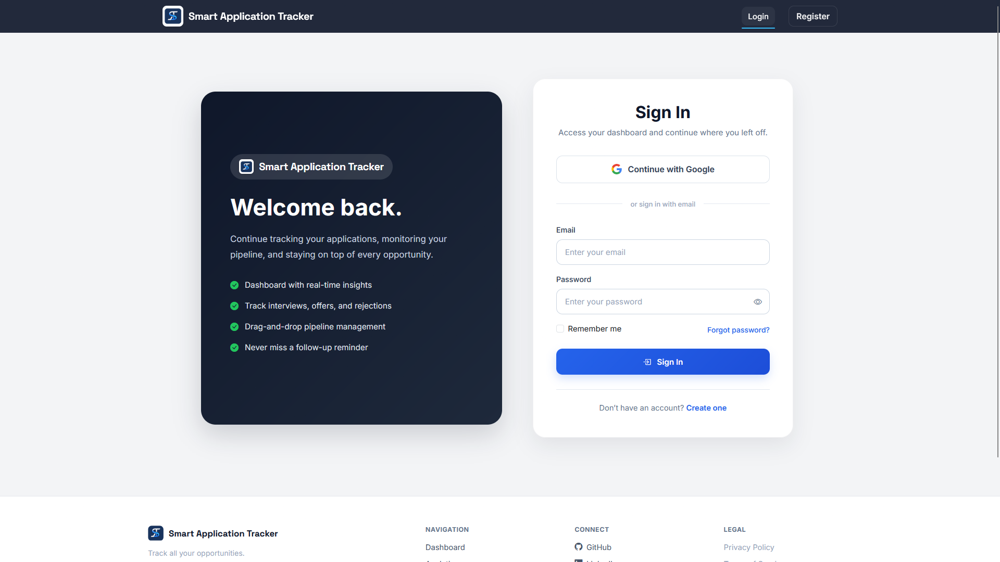
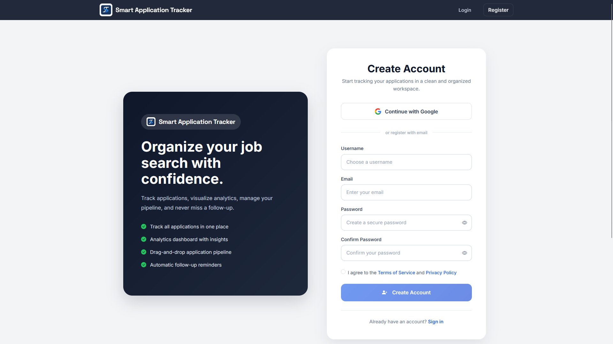
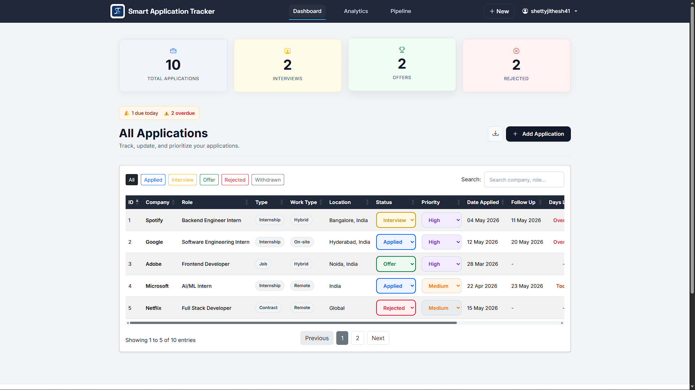
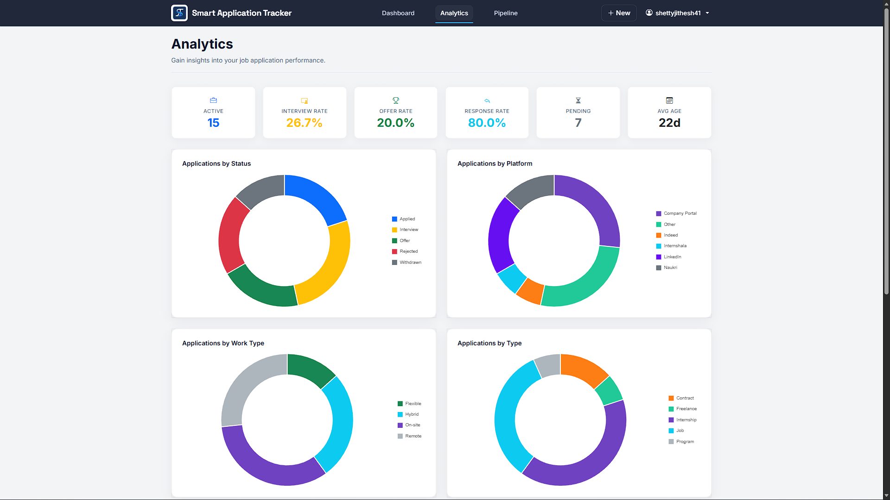
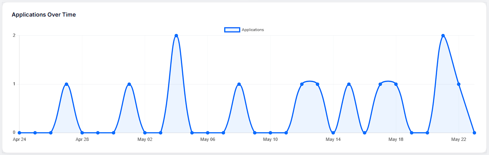
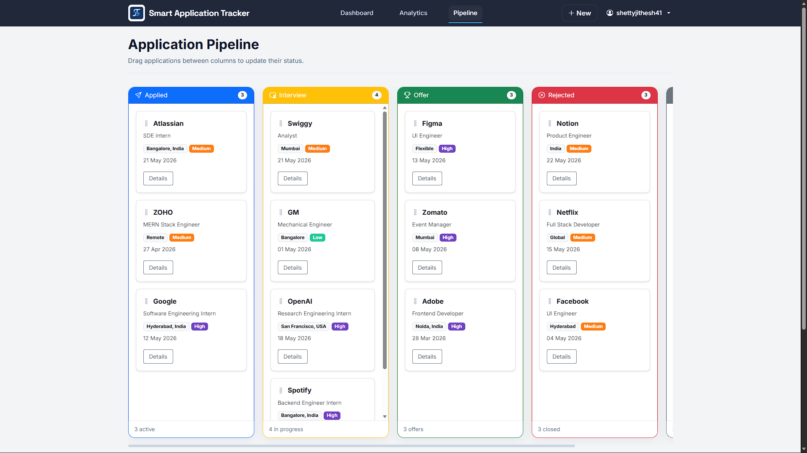
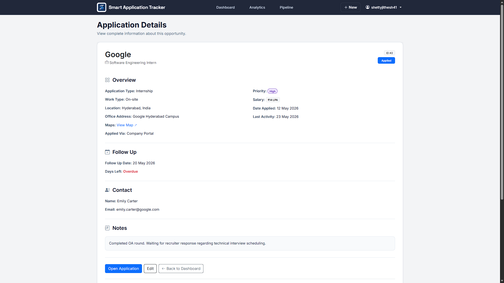

# Smart Application Tracker

A modern web-based job application tracking platform built with Flask that helps users organize, monitor, and analyze
their job search process.

Track applications across multiple platforms, manage interviews and follow-ups, visualize application trends through
analytics dashboards, and streamline your entire job search workflow from one place.

---

## 🚀 Features

### 🔐 Authentication & Security

* Secure user registration and login
* Google OAuth authentication
* Password hashing and secure session management
* Password reset via email
* Terms & Conditions and Privacy Policy pages

### 📋 Application Management

* Add, edit, and manage job applications
* Support for:

  * Jobs
  * Internships
  * Contracts
  * Freelance opportunities
  * Programs
* Track application status throughout the hiring process
* Archive applications without permanent deletion
* Store recruiter and contact information
* Manage salary details, notes, office locations, and application links

### 📊 Analytics Dashboard

* Application status distribution
* Platform-wise application tracking
* Work type analytics
* Application type analytics
* Response rate tracking
* Interview rate tracking
* Offer rate tracking
* Application timeline visualization

### 🔄 Pipeline View

* Kanban-style application pipeline
* Drag-and-drop workflow visualization
* Quickly identify application bottlenecks
* Track progress from application to offer

### 🔍 Productivity Features

* Search and filter applications
* Priority management (High / Medium / Low)
* Follow-up date tracking
* Days remaining calculations
* Status-based application management
* Responsive user interface

---

## 📸 Screenshots

### Login Page



### Registration Page



### Dashboard Overview



### Analytics Dashboard



### Application Timeline Analytics



### Pipeline View



### Application Details



---

## 🏗️ Project Architecture

The application follows a layered architecture for maintainability and scalability.

```text
Presentation Layer
│
├── HTML Templates
├── CSS
├── JavaScript
│
Business Logic Layer
│
├── Flask Routes
├── Application Manager
│
Data Layer
│
├── SQLAlchemy Models
├── SQLite Database
│
Authentication Layer
│
├── Flask-Login
├── Google OAuth
├── Email Authentication
```

---

## 📁 Project Structure

```text
smart-application-tracker/
│
├── models/
│   ├── user.py
│   └── job_application.py
│
├── services/
│   └── application_manager.py
│
├── static/
│   ├── css/
│   │   └── styles.css
│   │
│   └── images/
│       ├── favicon.png
│       └── sat_logo.png
│
├── templates/
│   ├── login.html
│   ├── register.html
│   ├── analytics.html
│   ├── pipeline.html
│   └── ...
│
├── screenshots/
│   ├── dashboard-overview.png
│   ├── analytics-overview.png
│   ├── application-details.png
│   └── ...
│
├── app.py
├── forms.py
├── oauth.py
├── extensions.py
├── utils.py
├── requirements.txt
└── README.md
```

---

## 🛠️ Tech Stack

### Backend

* Python
* Flask
* SQLAlchemy
* Flask-WTF
* Flask-Login
* Flask-Mail
* Authlib (Google OAuth)

### Frontend

* HTML5
* CSS3
* Bootstrap 5
* JavaScript
* jQuery
* DataTables
* Chart.js

### Database

* SQLite

### Authentication

* Email & Password
* Google OAuth

---

## ⚙️ Installation

### Clone the Repository

```bash
git clone https://github.com/RawPhoenix/smart-application-tracker.git

cd smart-application-tracker
```

### Create Virtual Environment

```bash
python -m venv venv
```

Activate it:

**Windows**

```bash
venv\Scripts\activate
```

**Linux / macOS**

```bash
source venv/bin/activate
```

### Install Dependencies

```bash
pip install -r requirements.txt
```

### Configure Environment Variables

Create a `.env` file:

```env
SECRET_KEY=your_secret_key

MAIL_USERNAME=your_email
MAIL_PASSWORD=your_password

GOOGLE_CLIENT_ID=your_google_client_id
GOOGLE_CLIENT_SECRET=your_google_client_secret
```

### Run the Application

```bash
python app.py
```

Open:

```text
http://127.0.0.1:5000
```

---

## 📊 Supported Application Statuses

* Applied
* Interview
* Offer
* Rejected
* Withdrawn

---

## 💡 Key Design Decisions

### Archive Instead of Delete

Applications are archived rather than permanently removed, reducing accidental data loss.

### User-Centric Analytics

Analytics are calculated per user, providing personalized insights into application performance.

### Service Layer Separation

Business logic is separated from route handling to improve maintainability and scalability.

### Responsive Design

The interface is optimized for desktop and tablet devices while maintaining usability across screen sizes.

---

## 🚀 Future Improvements

* Resume upload and management
* Resume parsing
* PostgreSQL support
* Interview scheduling calendar
* Email reminders for follow-ups
* Application export (CSV / PDF)
* Company insights dashboard
* AI-powered application recommendations

---

## 👨‍💻 Author

**Jithesh Shetty**

B.Tech Computer Science Engineering (AI & ML)

Passionate about building practical software solutions and exploring AI/ML technologies.

---

## ⭐ Feedback

If you found this project useful, consider giving the repository a star ⭐

Suggestions, improvements, and contributions are always welcome.
